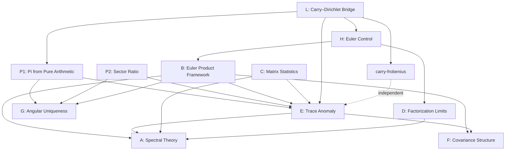

# carry-arithmetic

**The Carry Arithmetic Research Project**

*Author: Stefano Alimonti* · [ORCID 0009-0009-1183-1698](https://orcid.org/0009-0009-1183-1698)

A systematic investigation of the spectral theory, combinatorics, and number-theoretic properties of carry propagation in positional multiplication.

---

## Status Conventions

Status labels used across papers:
- **Proved** — unconditional theorem/proposition
- **Conditional** — follows under explicitly stated hypotheses
- **Numerical** — computational/numerical result with controlled evidence, rigorous proof pending
- **Open target** — precise remaining proof objective

---

## The Constellation

This project spans 14 repositories: 11 research papers and 3 reference libraries. Each is self-contained with paper/code, experiments, and reproducibility instructions.

### Flagship Papers

| Repo | Paper | Main Result |
|------|-------|-------------|
| [carry-arithmetic-A-spectral-theory](https://github.com/stefanoalimonti/carry-arithmetic-A-spectral-theory) | Spectral Theory of Carries | m-Bit Equidistribution Lemma extending Diaconis-Fulman (**Proved**) |
| [carry-arithmetic-P1-pi-spectral](https://github.com/stefanoalimonti/carry-arithmetic-P1-pi-spectral) | Pi from Pure Arithmetic | Structural framework and theorem set (**Proved**); central limit claim `R(∞)=-π` (**Open target**) |
| [carry-arithmetic-E-trace-anomaly](https://github.com/stefanoalimonti/carry-arithmetic-E-trace-anomaly) | The Trace Anomaly | Shifted resolvent mechanism for `R=-π` under LMH (**Conditional**) |
| [carry-arithmetic-B-zeta-approximation](https://github.com/stefanoalimonti/carry-arithmetic-B-zeta-approximation) | Carry Polynomials and the Euler Product | Central approximation framework (CRT, ULC; trace-anomaly program) |
| [carry-arithmetic-L-dirichlet-bridge](https://github.com/stefanoalimonti/carry-arithmetic-L-dirichlet-bridge) | The Carry–Dirichlet Bridge | Stopping-time Dirichlet series: μ ≈ c̃·(1+3⁻ˢ)·L²(s,χ₄) on Re(s)>1 (**Numerical**) |

### Pi Investigation

| Repo | Paper | Main Result |
|------|-------|-------------|
| [carry-arithmetic-P2-sector-ratio](https://github.com/stefanoalimonti/carry-arithmetic-P2-sector-ratio) | The Sector Ratio | Computational companion: Markov failure and structural decomposition |
| [carry-arithmetic-G-angular-uniqueness](https://github.com/stefanoalimonti/carry-arithmetic-G-angular-uniqueness) | Angular Uniqueness | Base 2 is unique: straight D-parity boundary produces π |

### Satellite Papers

| Repo | Paper | Main Result |
|------|-------|-------------|
| [carry-arithmetic-C-matrix-statistics](https://github.com/stefanoalimonti/carry-arithmetic-C-matrix-statistics) | Matrix Statistics | Markov-driven GOE↔GUE transition via effective rank reduction g(ρ) = (1−ρ²)/(1+ρ²) |
| [carry-arithmetic-D-factorization-limits](https://github.com/stefanoalimonti/carry-arithmetic-D-factorization-limits) | Factorization Limits | Carry-zero entropy bound: sub-polynomial core + exponential halo |
| [carry-arithmetic-F-covariance-structure](https://github.com/stefanoalimonti/carry-arithmetic-F-covariance-structure) | Covariance Structure | Exact second-order structure of binary carry chains |
| [carry-arithmetic-H-euler-control](https://github.com/stefanoalimonti/carry-arithmetic-H-euler-control) | Euler Control | Negative result: carry corrections add no info about zeta zeros |

### Standalone

| Repo | Paper | Main Result |
|------|-------|-------------|
| [carry-frobenius](https://github.com/stefanoalimonti/carry-frobenius) | Frobenius & Gauss Sums from Witt Carries | Exact Frobenius factors at p=3 and p=7 (**Proved**); cross-prime Artin-Schreier program (**Open target**) |

### Reference Libraries

| Repo | Language | Description |
|------|----------|-------------|
| [carrymath-py](https://github.com/stefanoalimonti/carrymath-py) | Python | Full reference implementation: 8 modules, 47 functions, exact rational arithmetic |
| [carrymath-js](https://github.com/stefanoalimonti/carrymath-js) | JavaScript | Full-parity port: all 8 modules with BigInt precision, 48 functions |
| [carrymath-c](https://github.com/stefanoalimonti/carrymath-c) | C | High-performance accelerator: carry chains, BFS entropy, enumeration (100–500× speedup) |

---

## Dependency Graph

## Suggested Reading Order

1. [**Paper A**](https://github.com/stefanoalimonti/carry-arithmetic-A-spectral-theory) (Spectral Theory) -- foundational: Diaconis-Fulman extension, m-bit lemma
2. [**Paper B**](https://github.com/stefanoalimonti/carry-arithmetic-B-zeta-approximation) (Euler Product Framework) -- central approximation: CRT, ULC, trace anomaly
3. [**Paper F**](https://github.com/stefanoalimonti/carry-arithmetic-F-covariance-structure) (Covariance) -- exact second-order structure
4. [**Paper P2**](https://github.com/stefanoalimonti/carry-arithmetic-P2-sector-ratio) (Sector Ratio) -- introduces the R(K) observable
5. [**Paper P1**](https://github.com/stefanoalimonti/carry-arithmetic-P1-pi-spectral) (Pi from Pure Arithmetic) -- the central conjecture R = -pi
6. [**Paper E**](https://github.com/stefanoalimonti/carry-arithmetic-E-trace-anomaly) (Trace Anomaly) -- the proof strategy via LMH and shifted resolvent
7. [**Paper G**](https://github.com/stefanoalimonti/carry-arithmetic-G-angular-uniqueness) (Angular Uniqueness) -- why base 2 is special
8. [**Paper C**](https://github.com/stefanoalimonti/carry-arithmetic-C-matrix-statistics) (Matrix Statistics) -- Markov-driven GOE↔GUE transition in sparse companion matrices
9. [**Paper D**](https://github.com/stefanoalimonti/carry-arithmetic-D-factorization-limits) (Factorization Limits) -- structural barrier for factoring
10. [**Paper H**](https://github.com/stefanoalimonti/carry-arithmetic-H-euler-control) (Euler Control) -- methodological control experiment (for Paper B)
11. [**Paper L**](https://github.com/stefanoalimonti/carry-arithmetic-L-dirichlet-bridge) (Carry–Dirichlet Bridge) -- stopping-time series and L²(s,χ₄)
12. [**carry-frobenius**](https://github.com/stefanoalimonti/carry-frobenius) (Witt Vectors) -- algebraic geometry bridge

## Statistics

| | Count |
|---|---|
| Papers | 12 |
| Reference libraries | 3 (Python, JavaScript, C) |
| Proved theorems / propositions | 35 |
| Open conjectures | 12 |
| Experiment scripts | ~170 |
| Cross-validation tests | 600+ |
| Languages | Python, JavaScript, C |

## License

All papers: CC BY 4.0. All code: MIT License.
